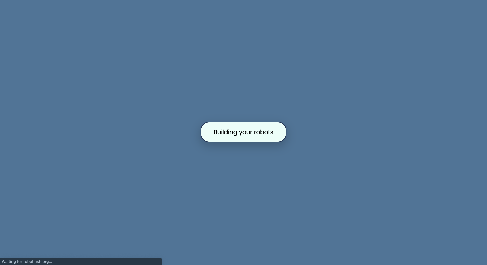
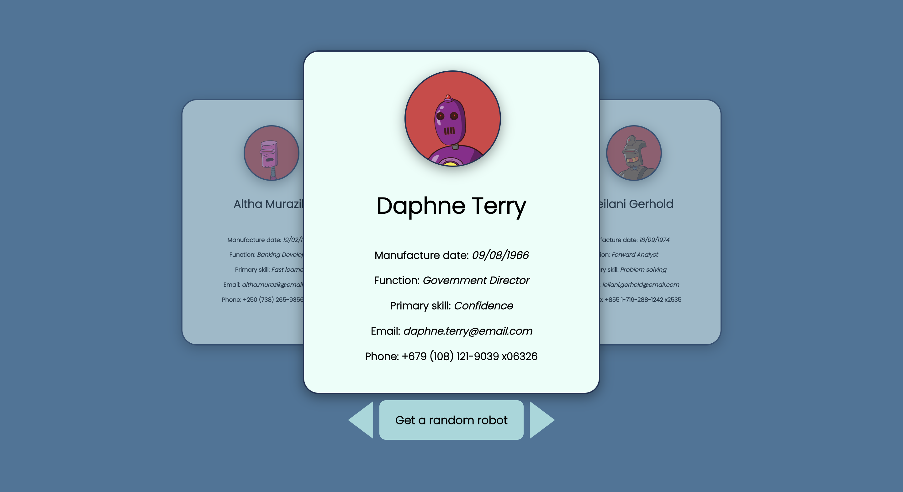
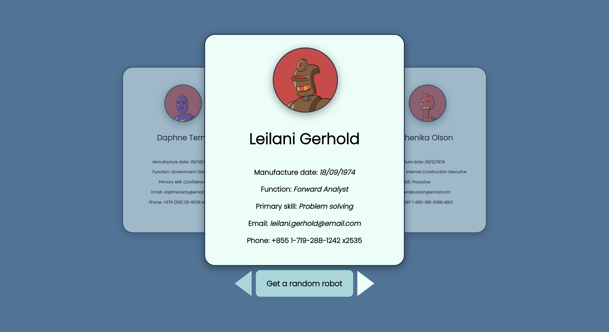
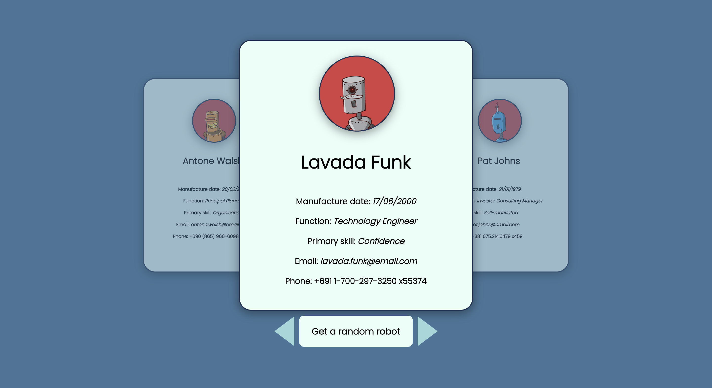

# Profile cards React component (fetch and display)

This component fetches a JSON of fake user information and then displays the information on a series of reusable profile card componenets. These cards can be navigated with a simple left/right button, or else the user can get a random profile card if they’re feeling spicy.

The intention behind this was simply to practice fetch requests, error handling and conditional rendering based on the fetch request’s status (that is, loading, completed or errored), along with more interesting CSS designs.

## Images of its usage

The first image shows a conditional loading screen to be displayed if the request is still pending. An animation eases the icon between a larger and smaller size to indicate to users that an action is being performed in the background if the fetch request takes some time. If the request fails then an alert will be displayed to the user to indicate that there’s been a problem fulfilling their request.

The second image shows the landing page after the fetch request has been completed. The design uses a blue monochrome palette to keep from being visually overwhelming on landing, while also providing some aesthetic contrast to the red accent in the image background.

The third image shows what happens when the user clicks to the right, selecting the next profile card in the series. On click the old center profile moves to the left, and becomes transparent and smaller, while the new selected profile moves to the center, increases in size and sets the opacity to ‘1’. Hovering over the left, right or random button shows a pointer cursor and lightens the colour of the hovered button.

The final image shows the effect of the random button, which will jump to a random point in the series and populate the previous, current and next profile cards with the appropriate data. From there the user can continue to navigate through the profile cards using the left and right button as expected. This feature likely has very little commercial application except for offering the user the joy of clicking a button.

